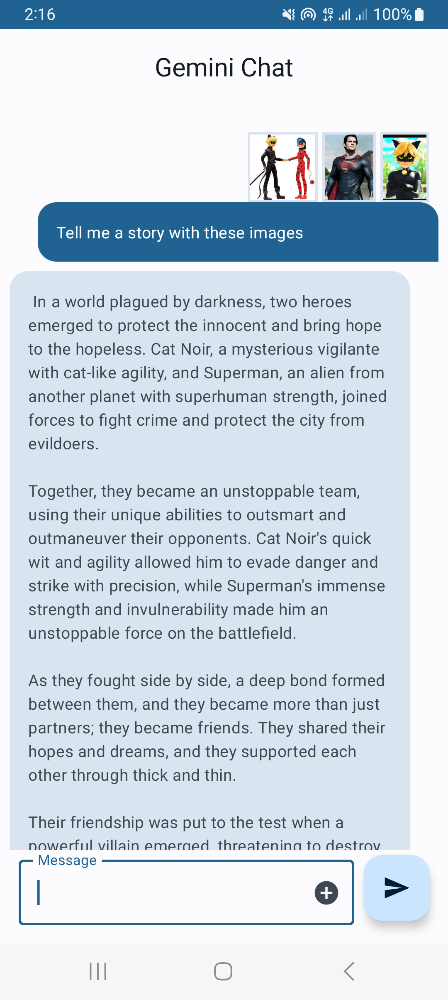

# geminichat

This is a sample project using Gemini Pro and Gemini Pro Vision. 

Gemini is the Google's latest family of large language models.
Just a small chatbot using both gemini-pro and gemini-pro-vision models.

_For the multi-turn conversations check the [Chat](https://github.com/yveskalume/gemini-chat/tree/chat) Branch. But it does not support images, 
the gemini-pro-vision model (for text-and-image input) is not yet optimized for multi-turn conversations._

Demo video : https://github.com/yveskalume/gemini-chat/blob/main/preview/geminichat.mp4
